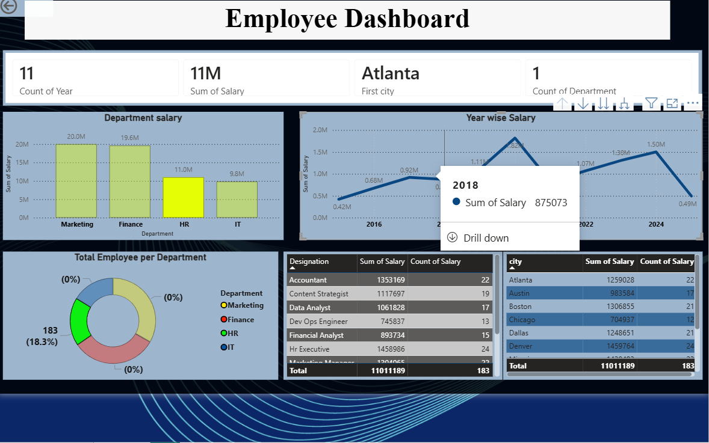

Next Leap | Power BI Data Analyst Project/business intelligence dashboard built using Microsoft Power BI to transform raw data into actionable insights.

Data Analyst skilled in Power BI, DAX, data modeling, and business intelligence reporting.
This project demonstrates end-to-end analytical workflow: data cleaning, transformation (ETL), KPI development, trend analysis, and executive dashboard design to support data-driven decision-making.

 Project Overview

This is  business intelligence dashboard built using Microsoft Power BI to transform raw data into actionable insights.

The project highlights my ability to:

Clean and prepare datasets

Build scalable data models

Create KPIs aligned with business objectives

Deliver clear, stakeholder-ready visual reports

 Business Objective

The goal of this project was to:

Monitor performance metrics effectively

Identify trends and growth opportunities

Detect underperforming segments

Support strategic decision-making through data

 Analytical Workflow
1️ Data Cleaning & Transformation (ETL)

Handled missing and inconsistent data

Standardized formats

Created calculated columns

Transformed raw datasets using Power Query

2️ Data Modeling

Built relationships between multiple tables

Applied structured data modeling techniques

Optimized performance using proper schema design

3️ KPI & Metric Development (DAX)

Created calculated measures

Developed performance indicators

Implemented time intelligence calculations

Built dynamic metrics responding to slicers

4️ Data Visualization & Reporting

Designed interactive dashboards

Applied visualization best practices

Created drill-down and filter capabilities

Focused on clarity, usability, and storytelling

 Technical Skills & Tools (ATS Optimized)

Microsoft Power BI

Power Query (ETL)

DAX (Data Analysis Expressions)

Data Modeling

KPI Development

Exploratory Data Analysis (EDA)

Business Intelligence Reporting

Data Visualization

Performance Analysis

Dashboard Design
 Dashboard Features

 Dynamic KPI Cards

 Trend & Time-Series Analysis

 Period-over-Period Comparisons

 Interactive Filters & Slicers

 Category & Segment Breakdown

 Performance Monitoring Metrics

 Business Insights Generated

This dashboard enables stakeholders to:

Identify top-performing segments

Monitor performance trends over time

Compare KPIs across categories

Detect operational inefficiencies

Make informed, data-driven decisions

 Project File

next leap power BI.pbix – Power BI Report File

To explore:

Download the .pbix file

Open using Microsoft Power BI Desktop

Interact with filters and report pages

Why This Project Adds Value

This project demonstrates my ability to:

Translate business questions into analytical solutions
 Apply structured problem-solving methods
 Develop measurable KPIs
 Communicate insights to non-technical stakeholders
 Deliver professional, decision-ready dashboards

 Future Enhancements

SQL database integration

Automated data refresh

Advanced forecasting models

Deployment to Power BI Service

Performance optimization for large datasets

 About Me

I am a Junior Data Analyst focused on leveraging data to drive business insights. I am actively seeking opportunities where I can apply analytical thinking, business intelligence tools, and data storytelling to solve real-world problems.

Let’s connect:

GitHub: [https://github.com/nirujayasundara]

LinkedIn: [www.linkedin.com/in/
nirosha-jayasundara-junior-data-analyst
]

